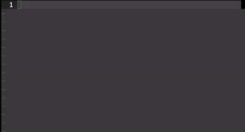

# Supercollider.snippets
Quickly code SuperCollider pieces with Vim/Snipmate using these snippets

To use it:
1. Install SnipMate for Vim
2. Download this .snippets file
3. Place it in ~/.vim/snippets (if the folder doesn't exist, create it first)
4. type one of the shortcuts – for example 'sd' - and press tab. 
5. Continue pressing tab to edit parameters

The nameconventions for the snippets are that ugens, demandrate stuff etc. is typed in lowercase with just the name, eg. SinOsc is sinosc and so on. There are other shortcuts for bigger stuff like for example 'sd' which folds out a SynthDef or 'pb' which folds out a Pbind with some standard stuff. Read through the .snippets file to get a feel for it. 
